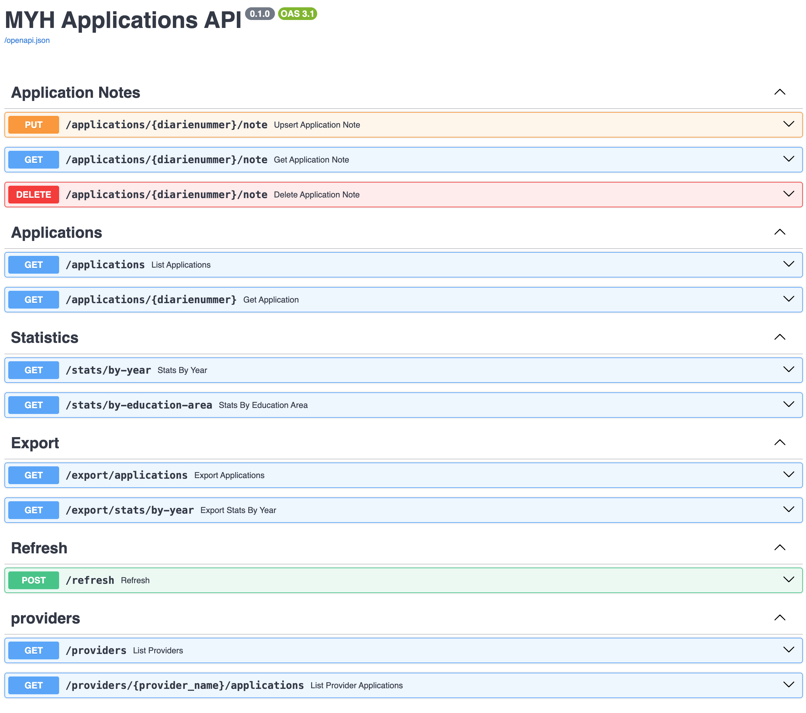

# API Design

## Purpose

The FastAPI backend exposes the curated MYH applications dataset to the Streamlit dashboard.

Main features:

- application browsing
- filtering
- statistics
- CSV export
- application notes
- refresh operations

---

## Swagger UI

FastAPI automatically generates interactive API documentation through Swagger UI.



---

## Main Endpoints

| Method | Endpoint | Description |
|---|---|---|
| GET | `/applications` | Return filtered application records |
| GET | `/applications/{diarienummer}` | Return a single application |
| PUT | `/applications/{diarienummer}/note` | Create or update an application note |
| GET | `/applications/{diarienummer}/note` | Return an application note |
| DELETE | `/applications/{diarienummer}/note` | Delete an application note |
| GET | `/stats/by-year` | Return yearly application statistics |
| GET | `/stats/by-education-area` | Return statistics grouped by education area |
| GET | `/export/applications` | Export application data as CSV |
| GET | `/export/stats/by-year` | Export yearly statistics as CSV |
| POST | `/refresh` | Rebuild and reload the curated dataset |
| GET | `/providers` | Return provider list |
| GET | `/providers/{provider_name}/applications` | Return provider applications |

---

## Protected Refresh Endpoint

The refresh endpoint triggers a full rebuild and reload of the curated dataset.

Because this operation modifies the database, the endpoint is protected with a simple API key header.

Required request header:

```http
x-api-key: <refresh-api-key>