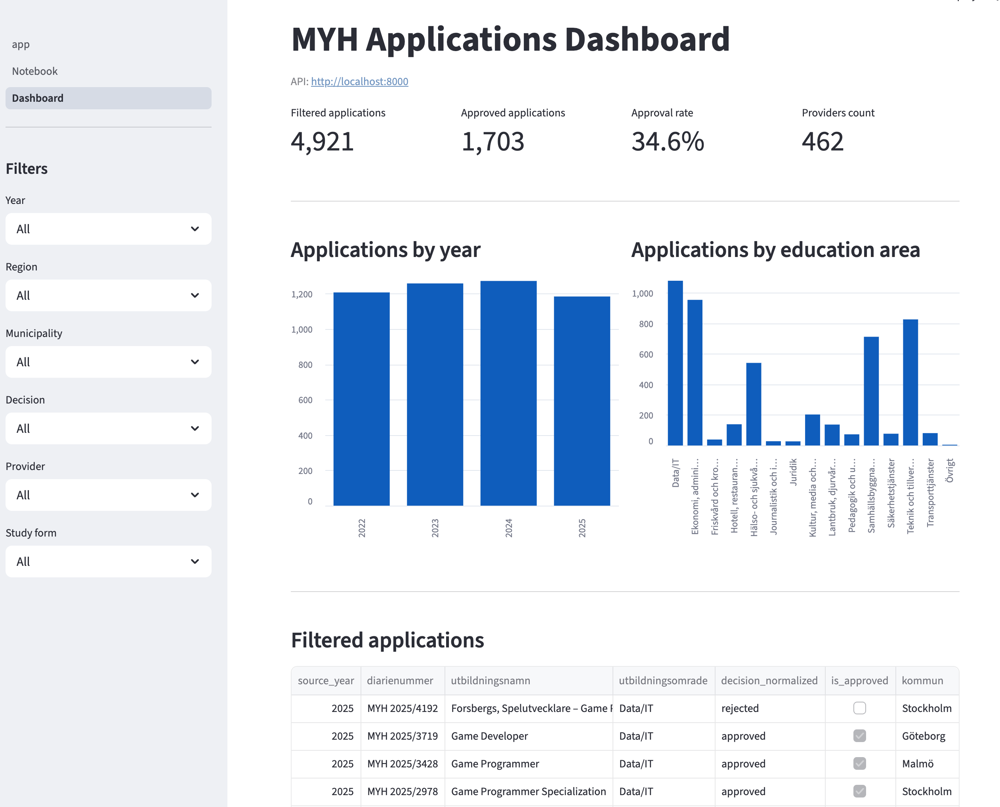

# Streamlit Structure

## Purpose

The Streamlit app is the frontend for the MYH applications analytics platform.

Main features:

- interactive dashboard
- filtering
- KPI metrics
- charts
- notebook preview
- CSV export
- refresh operations

The frontend lives in:

```text
streamlit_app/
```

---

## Dashboard Preview



---

## Frontend Structure

```text
streamlit_app/
├── app.py
├── pages/
└── core/
```

---

## Main Modules

| Module | Responsibility |
|---|---|
| `app.py` | Streamlit entry point |
| `pages/` | User-facing Streamlit pages |
| `core/api_client.py` | HTTP communication with FastAPI |
| `core/config.py` | Frontend constants and endpoint paths |
| `core/data_loader.py` | Dashboard data loading helpers |
| `core/filters.py` | Sidebar filter logic |
| `core/metrics.py` | KPI calculations and formatting |

---

## Dashboard Features

Current dashboard functionality includes:

- sidebar filters
- KPI cards
- yearly statistics
- education area statistics
- filtered application table
- provider filtering
- CSV export
- refresh operations

---

## Notebook Integration

The notebook page displays an exported HTML version of the data preparation notebook.

Notebook HTML files are stored in:

```text
streamlit_app/notebooks/
```

---

## Design Choices

The frontend keeps:

- UI logic inside Streamlit pages
- reusable logic inside `core/`
- API communication separated in `api_client.py`

This avoids large monolithic dashboard files as the project grows.

---

## Local Development

Run the frontend with:

```bash
python -m streamlit run streamlit_app/app.py
```

For full setup instructions, see:

```text
docs/deployment.md
```
